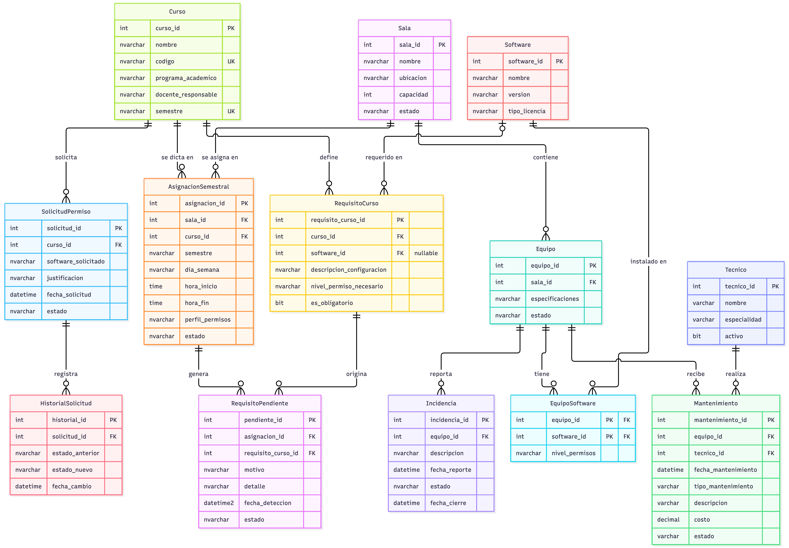

# SalaTrack — Sistema de Gestión y Análisis de Salas de Cómputo

Proyecto del curso **Bases de Datos Avanzadas** — Universidad Católica Luis Amigó

## 👥 Participantes y roles

| Usuario GitHub | Rol |
|---|---|
| [@sarasanchezes-bot](https://github.com/sarasanchezes-bot) | Líder de desarrollo |
| [@pedromcleanwa-dev](https://github.com/pedromcleanwa-dev) | Diseño de BD |
| [@John3202026](https://github.com/John3202026) | Analítica |

## 📋 Descripción del problema

Las salas de cómputo de la Universidad Católica Luis Amigó son un recurso crítico para las clases prácticas. Cada materia tiene necesidades técnicas distintas — un curso de bases de datos requiere un motor con protocolos habilitados, uno de videojuegos otras herramientas — pero no existe un sistema que registre qué ofrece realmente cada sala frente a lo que cada materia necesita, ni que deje evidencia de los problemas que ocurren durante las clases.

Un caso concreto: el software se instala según lo solicita cada docente, pero con restricciones de permisos que impiden modificar configuraciones, habilitar protocolos o instalar herramientas durante la clase — como ocurre al no poder habilitar conexiones TCP en un motor de base de datos. No hay un canal formal para reportar estas situaciones, ni registro de cuántas clases se ven afectadas y por qué.

La consecuencia de fondo: la institución no tiene datos para decidir qué salas presentan más problemas, qué equipos fallan repetidamente, qué materias resultan más afectadas, ni si conviene invertir en equipos o ajustar configuraciones. A esto se suma que los equipos se reconfiguran al inicio de cada semestre —se limpian e instalan los programas según lo que se requiera— sin una fuente estructurada que indique qué necesita cada materia, por lo que los mismos errores de configuración tienden a repetirse período tras período. Hoy esas decisiones y esa preparación se hacen sin evidencia ni memoria histórica.

SalaTrack será un sistema backend que registrará qué ofrece cada sala, qué requiere cada curso y qué ocurre durante las sesiones, para convertir ese cruce en información útil para la toma de decisiones.

**Alcance:** el sistema cubrirá las salas de clases y laboratorios: asignaciones semestrales, requisitos técnicos de cada curso frente a la dotación real de las salas, registro de incidencias, mantenimientos y análisis histórico. Queda fuera la reserva puntual de salas (que ya gestiona el sistema académico de la universidad), la gestión de las salas de la biblioteca (uso libre de estudiantes) y la administración de red e infraestructura física, que corresponde al área de sistemas.

El documento de requisitos completo (RF y RNF) está en [`docs/requisitos.md`](docs/requisitos.md).

## 🎯 Solución propuesta por unidades

El sistema abordará el problema en tres grandes módulos, cada uno con la tecnología más adecuada según lo visto en el curso:

**Gestión operativa (Unidad 1 — SQL Server):**
Se planea modelar y gestionar salas, equipos, software instalado, requisitos técnicos por curso, asignaciones semestrales y mantenimientos. Esta parte del sistema requerirá integridad transaccional y validaciones de compatibilidad entre lo que cada curso necesita y lo que cada sala ofrece, por lo que se trabajará sobre una base de datos relacional. Se explorarán herramientas avanzadas de SQL Server como stored procedures, triggers y CTEs a medida que se avance en el curso.

**Registro de eventos e incidencias (Unidad 2 — bases de datos no relacionales):**
Las incidencias reportadas durante las sesiones de clase son datos de naturaleza variable: una falla de hardware no tiene los mismos campos que un problema de permisos o un error de software. Por esta razón se planea explorar el uso de una base de datos no relacional para este módulo, que permita registrar cada incidencia con la estructura que mejor se adapte a su tipo, sin forzar un esquema fijo.

**Analítica para toma de decisiones (Unidad 3 — arquitecturas de datos en la nube):**
Se planea construir un módulo de análisis histórico que permita identificar patrones de uso, equipos con mayor frecuencia de falla y necesidades de inversión. El enfoque y las herramientas concretas de esta unidad se definirán a medida que se avance en los contenidos del curso.

| Unidad | Módulo | Estado |
|---|---|---|
| 1 | Base de datos relacional — SQL Server | ✅ Implementada |
| 2 | Base de datos documental — MongoDB | ⏳ Por desarrollar |
| 3 | Analítica y Data Warehouse | ⏳ Por desarrollar |

## 👤 Posibles usuarios del sistema

**Estudiantes:** utilizarán las salas en el marco de sus clases asignadas. No realizarán reservas directas — para trabajo autónomo cuentan con las salas de la biblioteca. Su rol en el sistema será reportar incidencias técnicas durante las sesiones (equipo que no enciende, software que no funciona, restricciones que impiden el desarrollo de la clase).

**Docentes:** registrarán los requisitos técnicos de sus cursos, solicitarán permisos o software adicional cuando sea necesario, y reportarán incidencias relacionadas con configuraciones que afecten sus clases.

**Técnicos de soporte:** registrarán y gestionarán mantenimientos, atenderán las incidencias reportadas y administrarán las configuraciones de software por sala.

**Coordinación académica / administrativa:** gestionará las asignaciones semestrales, consultará reportes analíticos y tomará decisiones de inversión o reposición de equipos.

## 🗂️ Modelo de datos

### Diagrama entidad-relación



El código fuente del diagrama está en [`docs/diagramas/salatrack_er.mmd`](docs/diagramas/salatrack_er.mmd), en formato Mermaid. Para regenerar la imagen tras un cambio de esquema, se pega ese archivo en [mermaid.live](https://mermaid.live) y se exporta como PNG.

La justificación de normalización hasta 3FN de las 13 tablas está en [`docs/normalizacion.md`](docs/normalizacion.md).

### Lista de entidades

Esta lista representa una aproximación inicial al modelo de datos. Se espera que evolucione a medida que se avance en los contenidos del curso.

**Sala** — identificador, nombre, ubicación, capacidad, estado.

**Equipo** — identificador, sala a la que pertenece, especificaciones básicas, estado.

**Software** — nombre, versión, tipo de licencia.

**EquipoSoftware** — relación entre equipos y software instalado, con nivel de permisos asignado.

**Tecnico** — identificador, nombre, especialidad, estado activo. Es el único actor modelado en el módulo relacional, por ser quien ejecuta las operaciones transaccionales de mantenimiento. Docentes y estudiantes no se modelan como entidad aquí: el docente responsable es un atributo de Curso, y el estudiante aparece únicamente como reportante de incidencias, que se modelan en MongoDB en la Unidad 2 (RNF-02).

**Curso** — id, nombre, código, programa académico, docente responsable, semestre.

**RequisitoCurso** — curso, software o configuración requerida, nivel de permisos necesario, obligatorio u opcional.

**AsignacionSemestral** — sala, curso, horario fijo (día, hora inicio, hora fin), semestre, perfil de permisos aplicado a la sala.

**Mantenimiento** — equipo, técnico responsable, fecha, tipo, descripción, estado.

**SolicitudPermiso** — docente, sala, configuración o software requerido, justificación, estado.

**HistorialSolicitud** — registro de cada cambio de estado de una SolicitudPermiso, con estado anterior, estado nuevo y fecha. Da soporte a la trazabilidad exigida por el RNF-03.

**RequisitoPendiente** — requisito obligatorio que una sala no cumple al momento de asignarle un curso, con motivo, detalle y estado. Se genera automáticamente desde `sp_asignar_curso_sala` y alimenta la lista de instalación del RF-07.

**Incidencia** — tabla mínima en SQL Server que existe solo para que `sp_registrar_mantenimiento` pueda cerrar incidencias abiertas de un equipo. El modelo real de incidencias, con estructura variable por tipo, se implementa en MongoDB en la Unidad 2 (RNF-02).

## 📏 Reglas de negocio

1. Al asignar una sala a un curso, el sistema deberá verificar la compatibilidad entre los requisitos técnicos del curso y la dotación real de la sala (software instalado y niveles de permisos). Si la sala no cumple los requisitos obligatorios del curso, la asignación quedará marcada como "asignada con requisitos pendientes" y generará automáticamente las solicitudes de instalación o permisos correspondientes al área técnica.

2. Al iniciar un nuevo semestre, el sistema deberá generar automáticamente la lista de software y configuraciones a instalar en cada sala, a partir de los cursos asignados y sus requisitos técnicos. Esto entrega al área de sistemas una guía estructurada para la preparación de los equipos, en lugar de depender de solicitudes dispersas o de la memoria de semestres anteriores.

3. El perfil de permisos de una sala estará asociado a su asignación semestral vigente y solo podrá ser modificado por un administrador, no por docentes ni estudiantes.

4. Un equipo en estado "en mantenimiento" o "fuera de servicio" no podrá ser contado como parte de la capacidad operativa de una sala al momento de validar una asignación.

5. Toda incidencia reportada durante una sesión de clase deberá ser atendida antes de la siguiente sesión del mismo curso en esa sala. El sistema llevará registro formal de cada incidencia — sala, equipo, clase afectada y estado de atención — para garantizar trazabilidad y evitar que problemas recurrentes queden sin respuesta institucional.

6. La acumulación de incidencias repetidas en un mismo equipo dentro de un período corto deberá generar automáticamente una alerta de mantenimiento, evitando que equipos problemáticos sigan en uso sin intervención técnica.

7. Toda solicitud de permiso o configuración adicional realizada por un docente deberá ser respondida — aprobada o rechazada con justificación — antes de la siguiente sesión del curso solicitante.

8. El sistema llevará registro del estado y tiempo de respuesta de cada solicitud, para que las restricciones que afectan el desarrollo de las clases tengan un canal formal de gestión.

## 🤔 ¿Por qué este proyecto es suficientemente complejo?

**1. El problema es real y multidimensional:**
No se trata de un ejercicio académico genérico. El sistema busca resolver una situación concreta que ocurre en la propia institución, con usuarios reales, restricciones reales y decisiones reales de por medio. Eso implica modelar matices que no aparecen en ejemplos de libro.

**2. Lógica de compatibilidad entre necesidades y recursos:**
El sistema deberá cruzar los requisitos técnicos de cada curso contra la dotación real de cada sala (software instalado y niveles de permisos), detectar brechas y generar acciones a partir de ellas — solicitudes automáticas al área técnica, alertas de incompatibilidad, seguimiento de resolución. Esta lógica va más allá del CRUD básico.

**3. Datos de distinta naturaleza que justifican distintas tecnologías:**
Las operaciones transaccionales (asignaciones, mantenimientos, solicitudes) y los eventos variables (incidencias) tienen características distintas que justifican aproximaciones diferentes al almacenamiento, lo cual conecta directamente con los objetivos del curso.

**4. Orientación a decisiones reales:**
El módulo analítico no será decorativo — buscará responder preguntas concretas: qué equipos deben reemplazarse, qué horarios tienen mayor demanda, qué cursos generan más incidencias. Información que una coordinación académica real necesitaría para tomar decisiones de inversión.

## 🚀 Puesta en marcha

### Requisitos previos

- SQL Server 2022 en ejecución (local o en Docker, puerto 1433)
- Un cliente SQL: VS Code con la extensión **MSSQL**, Azure Data Studio o `sqlcmd`

### Opción A — Script maestro (recomendada)

[`sql-server/00_deploy_all.sql`](sql-server/00_deploy_all.sql) reconstruye la base de datos completa desde cero, en orden de dependencias: esquema, seeds, vistas, función, procedimientos y triggers.

> ⚠️ Requiere **SQLCMD mode** activado, porque usa `:r` para incluir los demás archivos.
> En VS Code: icono *Enable SQLCMD* en la barra del editor de consultas. Con `sqlcmd` funciona por defecto.
>
> ⚠️ La sección 0 del script **borra la base de datos `SalaTrack` si ya existe**.

Ejecutar desde la carpeta `sql-server/`, ya que las rutas son relativas:

```bash
cd sql-server
sqlcmd -S localhost,1433 -U sa -C -i 00_deploy_all.sql
```

### Opción B — Archivo plano (plan B si SQLCMD mode no activa)

[`build_deploy_flat.sh`](sql-server/build_deploy_flat.sh) concatena los mismos archivos, en el mismo orden, en un único `.sql` que se ejecuta tal cual:

```bash
cd sql-server
bash build_deploy_flat.sh      # genera 00_deploy_all_flat.sql
```

El archivo generado está en `.gitignore` y no se versiona: para cambiar su contenido se editan los archivos fuente y se vuelve a correr el script.

### Verificar que quedó bien

```sql
USE SalaTrack;
GO
SELECT * FROM vw_verificacion_compatibilidad;
```

### Demostración

[`sql-server/demo/demo_unidad1.sql`](sql-server/demo/demo_unidad1.sql) recorre en orden todos los objetos de la Unidad 1 y sirve como guion de la sustentación oral.

## 🗄️ Objetos de base de datos (Unidad 1 — SQL Server)

Esta sección describe los objetos ya implementados sobre el módulo relacional, y cómo ejecutarlos.

### Vistas

Ubicadas en `sql-server/views/`:

**`vw_verificacion_compatibilidad`** (`verificar_compatibilidad.sql`) — Dada una sala y un curso, indica si la sala cumple los requisitos obligatorios del curso, cruzando `RequisitoCurso` contra `EquipoSoftware`. Apoya el RF-06.
```sql
SELECT * FROM vw_verificacion_compatibilidad;
```

**`vw_lista_instalacion`** (`lista_instalacion.sql`) — Agrupa por sala el software obligatorio que le falta instalar. Apoya el RF-07.
```sql
SELECT * FROM vw_lista_instalacion;
```

**`vw_requisitos_por_curso`** (`requisitos_por_curso.sql`) — Lista, por curso, sus requisitos técnicos separando obligatorios de opcionales. Apoya el RF-05.
```sql
SELECT * FROM vw_requisitos_por_curso ORDER BY curso_id, categoria;
```

### Funciones

Ubicadas en `sql-server/functions/`:

**`fn_requisitos_pendientes_sala(@sala_id)`** — Función de tabla que, para una sala dada, devuelve el software obligatorio que le falta a partir de sus asignaciones vigentes.
```sql
SELECT * FROM fn_requisitos_pendientes_sala(1);
```

### Triggers

Ubicados en `sql-server/triggers/`:

**`trg_mantenimiento_actualiza_equipo`** — `AFTER INSERT` en `Mantenimiento`; pone `Equipo.estado = 'en mantenimiento'` automáticamente al registrar un mantenimiento nuevo.

**`trg_historial_solicitud`** — `AFTER UPDATE` en `SolicitudPermiso`; registra en `HistorialSolicitud` cada cambio de estado de una solicitud. Apoya el RNF-03 y el RF-10.

### CTEs

Ubicadas en `sql-server/queries/08_ctes_reportes.sql`:

**CTE 1** — Ranking de salas por cantidad de requisitos obligatorios faltantes, usando `RANK()`.

**CTE 2 (recursiva)** — Genera el calendario completo de sesiones de clase de cada asignación semestral. Apoya el RF-11.

### Procedimientos almacenados

Ubicados en `sql-server/procedures/`:

**`sp_asignar_curso_sala`** — Asigna un curso a una sala validando disponibilidad, y genera automáticamente los registros en `RequisitoPendiente` si la sala no cumple algún requisito obligatorio. Transacción con `SET XACT_ABORT ON` y `THROW`. Apoya el RF-06.
```sql
DECLARE @id INT;
EXEC sp_asignar_curso_sala
    @sala_id = 1, @curso_id = 1, @semestre = '2026-2',
    @dia_semana = 'Viernes', @hora_inicio = '08:00', @hora_fin = '10:00',
    @perfil_permisos = 'administrador', @asignacion_id = @id OUTPUT;
SELECT @id;
```

**`sp_registrar_mantenimiento`** — Registra un mantenimiento nuevo y cierra las incidencias abiertas del equipo asociado, usando `SAVE TRANSACTION` para no perder el mantenimiento si falla el cierre de incidencias.
```sql
EXEC sp_registrar_mantenimiento
    @equipo_id = 3, @tecnico_id = 1,
    @tipo_mantenimiento = 'Correctivo',
    @descripcion = 'Revision de pantalla', @costo = 30000.00;
```

**`sp_generar_lista_instalacion`** — Genera la lista de software y configuraciones a instalar por sala para un semestre, a partir de los cursos asignados y sus requisitos. Apoya el RF-07 y la regla de negocio 2.

**`sp_registrar_solicitud_permiso`** — Registra una nueva solicitud de permiso/software para un curso, protegiendo con una transacción los dos inserts relacionados (`SolicitudPermiso` + `HistorialSolicitud`). `SET XACT_ABORT ON`. Apoya el RF-10.
```sql
EXEC sp_registrar_solicitud_permiso
    @curso_id = 1,
    @software_solicitado = 'Godot Engine',
    @justificacion = 'Curso electivo de videojuegos';
```

### Scripts de prueba

Ubicados en `sql-server/tests/`, formato `test_<numero>_<nombre_del_sp>.sql`. Cada uno incluye un caso que confirma el funcionamiento normal y un caso que fuerza un error para verificar que la transacción revierte correctamente.

## 📁 Estructura del repositorio

```
SalaTrack/
├── README.md
├── .gitignore
│
├── docs/                                  # Documentación del proyecto
│   ├── requisitos.md                      # Requisitos funcionales y no funcionales
│   ├── normalizacion.md                   # Justificación 3FN de las 13 tablas
│   ├── ia-log.md                          # Bitácora de uso de IA
│   └── diagramas/
│       ├── salatrack_er.png               # Diagrama entidad-relación
│       └── salatrack_er.mmd               # Fuente Mermaid del diagrama
│
├── sql-server/                            # Unidad 1 — módulo relacional
│   ├── 00_deploy_all.sql                  # Script maestro de despliegue
│   ├── build_deploy_flat.sh               # Generador del script plano (plan B)
│   ├── schema/                            # DDL: creación de tablas y relaciones
│   ├── seeds/                             # Datos de prueba
│   ├── views/                             # Vistas de consulta
│   ├── functions/                         # Funciones de tabla
│   ├── procedures/                        # Procedimientos almacenados
│   ├── triggers/                          # Triggers de reglas de negocio
│   ├── queries/                           # CTEs y consultas de reporte
│   ├── tests/                             # Pruebas de los procedimientos
│   └── demo/                              # Guion de la sustentación oral
│
├── mongodb/                               # Unidad 2 — módulo documental
└── data-warehouse/                        # Unidad 3 — módulo analítico
```

## 🔀 Flujo de trabajo

| Rama | Uso |
|---|---|
| `main` | Rama protegida. Solo recibe cambios por pull request aprobado; sin force-push ni borrado. |
| `dev` | Rama de integración donde se consolidan los avances. |
| `feature/<nombre>` | Una rama por funcionalidad. Se abre desde `dev` y vuelve a `dev` por PR. |

El merge a `main` lo realiza la líder de desarrollo. Los demás integrantes abren pull requests, que se revisan antes de integrarse.

## 🤖 Política de uso de IA

**Herramientas utilizadas:** Claude (Anthropic).

**Cómo se ha usado hasta ahora:**
Durante la fase de definición del proyecto se utilizó IA para explorar distintos dominios posibles y evaluar su viabilidad. La herramienta propuso varios enfoques que fueron descartados por no reflejar un problema cercano o suficientemente real. La selección final del dominio surgió de la experiencia directa de la autora como estudiante de la institución. La IA también se usó para orientar qué tipos de tecnologías podrían ser adecuadas para cada módulo del sistema — una decisión que la autora no podía tomar con certeza por no haber cursado aún las unidades 2 y 3. Esa orientación tecnológica se tomó como punto de partida provisional, sujeta a ajuste a medida que avance el curso.

**Usos durante el desarrollo:**

- Apoyo en la escritura de consultas y estructuras técnicas, las cuales son revisadas y comprendidas antes de incorporarse.
- Generación de datos de prueba para poblar las bases de datos.
- Revisión y retroalimentación sobre decisiones de modelado.

**Ejemplos de prompts utilizados:**

Los siguientes son ejemplos representativos del tipo de consultas realizadas a la IA durante la definición del proyecto. En todos los casos, el contexto y el problema fueron aportados por la autora, y la IA se usó para validar, refinar o resolver dudas puntuales:

> "En esa clase el profe se quejaba de un problema real en la universidad: las salas de cómputo tienen software instalado pero con permisos restringidos que no dejan configurar cosas en clase. Quiero construir mi proyecto de bases de datos sobre esto. ¿Este problema da para usar bases de datos relacionales, no relacionales y análisis de datos, o se queda corto? Aparte quiero que me sugieras más ideas por si el mío no sirve para el uso de las bases de datos que ya te mencioné."

> "El sistema académico de mi universidad ya permite reservar salas, así que no quiero duplicar eso. Mi enfoque sería el cruce entre lo que cada materia necesita y lo que cada sala realmente tiene. ¿Cómo modelo los requisitos técnicos de un curso como entidad?"

> "Los estudiantes en mi universidad no reservan salas porque usan las de la biblioteca. ¿Cómo debería ajustar el rol del estudiante en mi sistema para que sea coherente con eso?"

El registro completo de interacciones —qué se preguntó, qué se aceptó y qué se descartó en cada caso— se lleva en [`docs/ia-log.md`](docs/ia-log.md) y se actualiza a medida que avanza el proyecto.

**Compromisos:**

- Todo lo generado con IA es revisado y comprendido por el equipo antes de ser commiteado.
- En la defensa oral se pueden explicar y justificar todas las decisiones de diseño.

---

<sub>Proyecto académico — Bases de Datos Avanzadas, Universidad Católica Luis Amigó.</sub>
